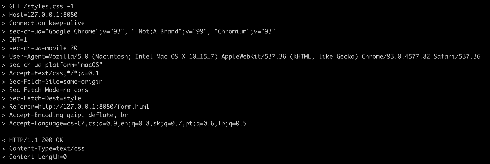

# HTTP server in C

Just simple prefork HTTP server without any dependencies.



- supports GET
- supports serving static files

How to start

```
make
./server
```

## TODO

- support POST, PUT, PATCH
- routing
- parametrized views
- template rendering
- docs :D
